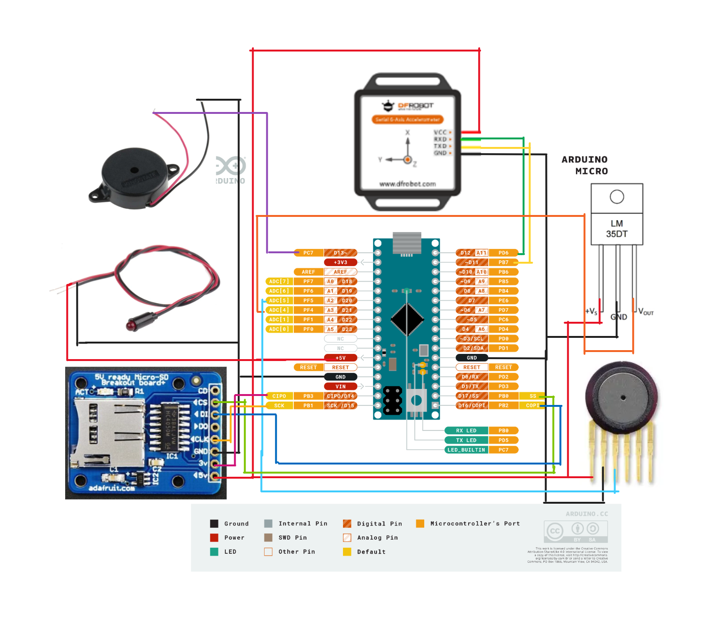

# Rocket Instrumentation System

[](https://www.arduino.cc/en/hardware/micro)
[](LICENSE)
[](https://warwick.ac.uk/)
[](https://github.com/topics/education)
[](https://en.wikipedia.org/wiki/Aerospace_engineering)

## Overview

An Arduino-based payload sensor system designed for collecting comprehensive telemetry data during water rocket flights. This compact instrumentation package provides real-time data acquisition for flight dynamics analysis, recovery assistance, and educational aerospace applications.

### Applications
- **Educational Rocketry** — Hands-on aerospace engineering demonstrations
- **Flight Dynamics Research** — Data collection for trajectory and performance analysis
- **STEM Outreach** — Interactive learning platform for physics and engineering concepts
- **Competition Rocketry** — Telemetry systems for water rocket competitions

## Features

- 🚀 **Multi-Axis Motion Tracking** — Complete 6-DOF measurement with triaxial accelerometer and gyroscope
- 🌡️ **Environmental Monitoring** — Atmospheric pressure and temperature sensing for altitude calculation
- 💾 **Data Logging** — High-frequency data capture to microSD card storage
- 🔊 **Recovery System** — Audible buzzer for post-flight payload location
- 💡 **Status Indication** — Visual power and system status monitoring
- 📊 **Real-time Processing** — Onboard altitude calculation and flight phase detection

## Technical Specifications

### Performance Characteristics
- **Data Acquisition Rate:** Up to 100 Hz sampling frequency
- **Flight Duration:** 15+ minutes continuous logging (9V battery)
- **Altitude Range:** 0-1000m (limited by pressure sensor)
- **Acceleration Range:** ±16g triaxial measurement
- **Operating Temperature:** -10°C to +85°C

### Sensor Array
| Sensor | Model | Measurement | Range | Precision |
|--------|--------|-------------|--------|-----------|
| **Accelerometer/Gyroscope** | [DFRobot WT61PC](https://www.dfrobot.com/product-2200.html) | 3-axis acceleration & angular velocity | ±16g, ±2000°/s | 16-bit resolution |
| **Pressure Sensor** | MPX4115A | Atmospheric pressure | 15-115 kPa | ±1.5% accuracy |
| **Temperature Sensor** | LM35DT | Ambient temperature | -55°C to +150°C | ±0.5°C accuracy |

### Hardware Components
- **Microcontroller:** Arduino Micro (ATmega32U4)
- **Storage:** MicroSD card (FAT32 formatted)
- **Power:** 9V alkaline battery (6-12V input range)
- **Recovery Aid:** Piezo buzzer (85dB @ 10cm)
- **Status Display:** Power indicator LED

## Quick Start

### Prerequisites
- **PlatformIO IDE** (VS Code extension recommended)
- **MicroSD Card** (Class 10 recommended, FAT32 formatted)
- **9V Battery** and connector cable

### Required Libraries

The following libraries are automatically managed via `platformio.ini`:

```ini
lib_deps = 
   https://github.com/DFRobot/DFRobot_WT61PC.git @ 1.0.0
   SD @ 1.2.4
```

| Library | Purpose | Documentation |
|---------|---------|---------------|
| **DFRobot_WT61PC** | IMU sensor interface for accelerometer/gyroscope data acquisition | [GitHub](https://github.com/DFRobot/DFRobot_WT61PC) |
| **SD** | MicroSD card file system operations and data logging | [Arduino Reference](https://www.arduino.cc/reference/en/libraries/sd/) |

### Installation

1. **Clone the Repository**
   ```bash
   git clone https://github.com/AdzCoder/rocket-sensor.git
   cd rocket-sensor
   ```

2. **Hardware Assembly**
   
   Follow the detailed wiring instructions in [`DESIGN.md`](docs/DESIGN.md) or reference the circuit diagram:
   
   
   
   **Key Connections:**
   - WT61PC: I2C (SDA/SCL pins)
   - MPX4115A: Analogue pin A0
   - LM35DT: Analogue pin A1
   - SD Module: SPI interface
   - Buzzer: Digital pin 8
   - LED: Digital pin 13

3. **Software Upload**
   ```bash
   # Open project in PlatformIO
   pio run
   # Upload to device
   pio run --target upload
   # Monitor serial output (optional)
   pio device monitor
   ```

4. **Pre-Flight Checklist**
   - Insert formatted SD card
   - Connect 9V battery
   - Verify LED power indication
   - Test buzzer functionality
   - Confirm sensor readings via serial monitor

## Data Output

### CSV File Format
Data is logged to the SD card as a `.CSV` with timestamp-based naming:

```csv
Time(ms),Pressure(Pa),Temperature(C),Height(m),AccelX(m/s2),AccelY(m/s2),AccelZ(m/s2),TotalAccel(m/s2),GyroX(deg/s),GyroY(deg/s),GyroZ(deg/s)
```

### Sample Data Structure
| Column | Unit | Description |
|--------|------|-------------|
| **Time** | ms | Milliseconds since system startup |
| **Pressure** | Pa | Atmospheric pressure (absolute) |
| **Temperature** | °C | Ambient temperature |
| **Height** | m | Calculated altitude above launch point |
| **AccelX/Y/Z** | m/s² | Triaxial acceleration components |
| **TotalAccel** | m/s² | Vector magnitude of acceleration |
| **GyroX/Y/Z** | °/s | Angular velocity components |

### Post-Flight Analysis
- **Flight Phases:** Launch, coast, apogee, descent identification
- **Performance Metrics:** Maximum altitude, peak acceleration, flight duration
- **Trajectory Analysis:** Velocity and position estimation through integration
- **Recovery Data:** Descent rate and landing impact analysis

## System Operation

### Flight Modes
1. **Pre-Launch** — System initialisation and sensor calibration
2. **Launch Detection** — Acceleration threshold triggering
3. **Flight Logging** — High-frequency data acquisition
4. **Recovery Mode** — Buzzer activation for payload location

### Safety Features
- **Automatic Shutdown** — Low battery protection
- **Data Integrity** — Regular file synchronisation to prevent data loss
- **Fault Detection** — Sensor error handling and status reporting

## Documentation

- 📋 **[Design Documentation](docs/DESIGN.md)** — Detailed system architecture and component selection
- 🔌 **[Wiring Diagrams](docs/circuit_plan.png)** — Complete electrical schematic
- 🧪 **[Test Results](docs/TESTING.mb/)** — Ground testing and validation data

## Project Information

**Development Team:** Group A04  
**Institution:** University of Warwick, School of Engineering  
**Module:** [ES192: Engineering Design (2022/23)](https://courses.warwick.ac.uk/modules/2022/ES192-15)  
**Sprint:** Electronic Systems Design Sprint 2

### Learning Objectives
- **Sensor Integration** — Multi-sensor data fusion and calibration
- **Real-time Systems** — High-frequency data acquisition under constraints
- **Embedded Programming** — Arduino development for aerospace applications
- **System Design** — Requirements analysis and hardware selection

## Troubleshooting

### Common Issues
| Problem | Symptoms | Solution |
|---------|----------|----------|
| **No Data Logging** | LED on, no CSV file | Check SD card formatting (FAT32) |
| **Sensor Errors** | Serial output shows NaN | Verify I2C connections and library versions |
| **Power Issues** | Intermittent operation | Check 9V battery voltage (>7V required) |
| **Recovery Buzzer** | No sound after flight | Verify buzzer connections and pin 8 continuity |

## Future Enhancements

Identified improvements for next iteration:
- **GPS Integration** — Absolute position tracking for recovery
- **Wireless Telemetry** — Real-time data transmission during flight
- **Advanced Sensors** — Magnetometer for orientation determination
- **Data Visualisation** — Onboard display for real-time monitoring
- **Multi-Stage Detection** — Support for multi-stage rocket configurations

## Contributing

This educational project has been completed, but contributions are welcome:

1. **Fork the repository** for your own experiments
2. **Document modifications** clearly for other students
3. **Share results** with the academic community
4. **Maintain educational focus** in any derivatives

## Project Status

**Status:** Completed (Academic Year 2022/23)  
**Maintenance:** Educational reference - not actively maintained  
**Usage:** Available for student projects and educational demonstrations

This project successfully demonstrated practical application of embedded systems in aerospace instrumentation and provided valuable hands-on experience in sensor integration and real-time data acquisition.

## Licence

MIT Licence — see the [LICENCE](LICENSE) file for details.

---

*Developed as part of the Engineering Design module at the University of Warwick. This project showcases practical application of electronic systems in aerospace engineering education.*
