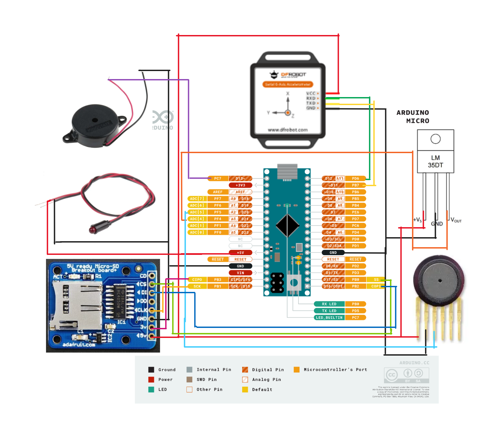

# Design Documentation

## System Overview

The system was designed to collect flight data from a water rocket including:
- Atmospheric pressure changes during ascent/descent
- Triaxial acceleration data
- Temperature changes
- Calculated altitude

## Components

### Sensors
- **Accelerometer**: DFRobot WT61PC 6-axis IMU
  - Measures acceleration and angular velocity
  - Output frequency configurable up to 200Hz
- **Pressure Sensor**: MPX4115A
  - Measures 15-115 kPa absolute pressure
  - Used to calculate altitude changes
- **Temperature Sensor**: LM35DT
  - Measures -55°C to +150°C range
  - Linear 10mV/°C output

### Data Storage
- MicroSD card breakout board
- FAT32 formatted SD card

### Indicators
- Piezo buzzer (85-96dB) for recovery
- Red LED panel light for power status

## Circuit Design

Power:
- 9V battery
- Arduino Micro voltage regulation

Connections:
- Accelerometer: SoftwareSerial on pins 10(RX),11(TX)
- Pressure Sensor: Analog A2
- Temperature Sensor: Analog A3
- SD Card: SPI on pin 17(CS)
- Buzzer: Digital 13
